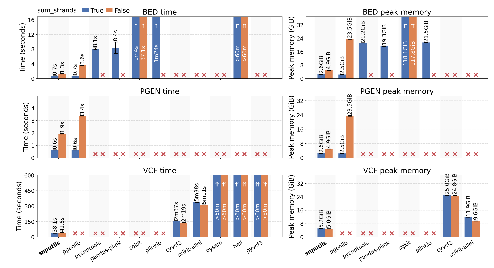

# Readers Benchmark

## Results

On the chromosome 22 of the 1000 Genomes Project dataset:

## Methodology

The reader benchmark measures wall-clock read time and peak memory on chromosome 22 from the 1000 Genomes Project dataset.

Each reader is run in an Slurm allocation with 8 AMD EPYC 9684X CPU cores and 200 GB of RAM and a Python 3.12 environment.
Python 3.12 is used because some libraries are not yet compatible with Python 3.13 or 3.14.

After running the benchmark, the plotting utility `benchmark/plot_time_memory.py` writes both `benchmark/readers_benchmark.png` and `benchmark/readers_benchmark.pdf` from existing benchmark JSON files.

## Contributing

We strive to ensure fair comparisons across all libraries in our benchmark. If you believe the implementation using any of the compared libraries could be made more efficient, we warmly welcome your contributions! Please don't hesitate to open a pull request with your improvements. This helps ensure we're showcasing each library's best performance characteristics and benefits the entire genomics community.
