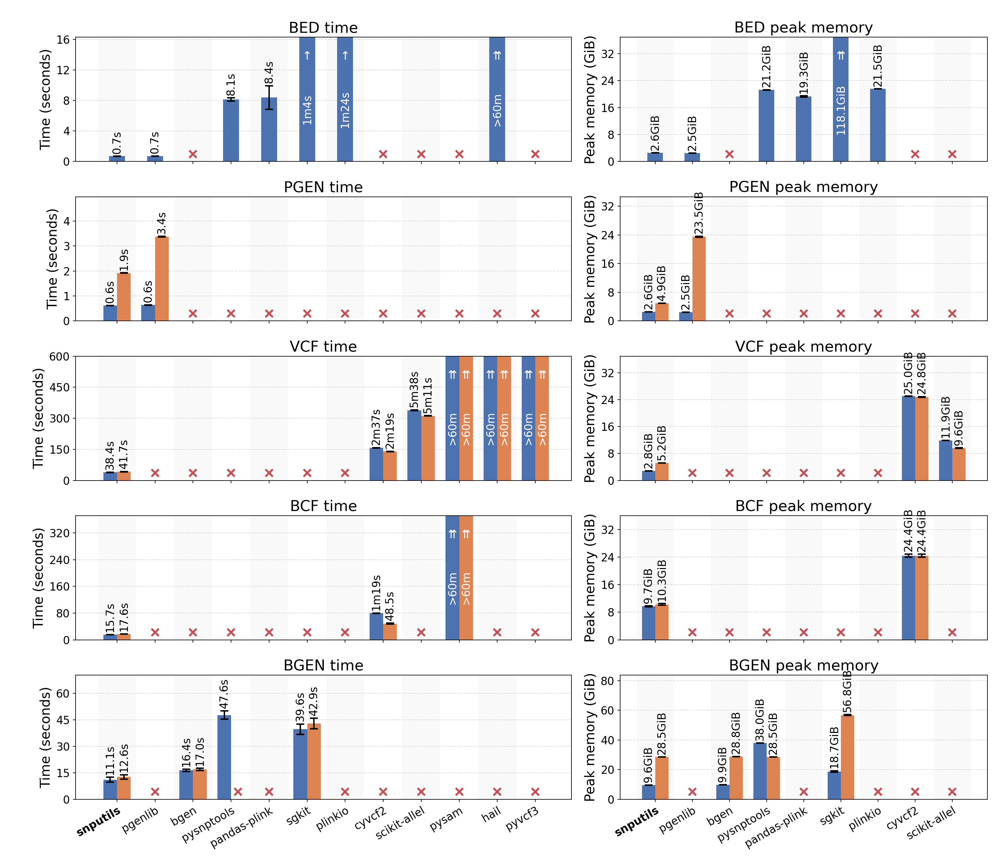

# Readers Benchmark

## Results

On the chromosome 22 of the 1000 Genomes Project dataset:

**Legend: `genotype_mode`**:
- 🟦 `"dosage"`: ALT dosage (`0|0 -> 0`, `0|1 -> 1`, `1|0 -> 1`, `1|1 -> 2`)
- 🟧 `"phased"`: allele codes for PGEN, VCF, and BCF (`0|1 -> [0, 1]`); the BGEN panel instead uses `"probabilities"` to materialize the complete `float32` genotype-probability (`GP`) tensor

The BGEN GP results are:

| Reader | Time (mean ± SD) | Peak memory (mean ± SD) |
| --- | ---: | ---: |
| **snputils** | 13.31 ± 1.11 s | 28.5082 ± 0.0002 GiB |
| bgen | 16.49 ± 0.23 s | 28.3963 ± 0.0002 GiB |
| pysnptools | 51.49 ± 1.33 s | 28.5433 ± 0.0003 GiB |
| sgkit | 58.05 ± 1.94 s | 56.8980 ± 0.2273 GiB |

## Methodology

The reader benchmark measures wall-clock read time and peak memory on chromosome 22 from the 1000 Genomes Project dataset.

Each reader is run in an Slurm allocation with 8 AMD EPYC 9684X CPU cores and 200 GB of RAM and a Python 3.12 environment.
Python 3.12 is used because some libraries are not yet compatible with Python 3.13 or 3.14.

For BGEN, the dosage condition materializes expected alternate-allele counts from biallelic probabilities, while the orange condition materializes the complete `float32` genotype-probability tensor. The input contains 993,881 variants and 2,548 samples. This permits a like-for-like comparison across BGEN readers, including libraries that do not preserve phase. Every completed BGEN reader is checked against the corresponding output from the independent `bgen` package outside the timed and memory-profiled region. The correctness comparison is performed in variant chunks so that it does not create a second full-size comparison mask. Hail is omitted because its first GP materialization exhausted the fixed 200 GB allocation before returning the tensor.

After running the benchmark, the plotting utility `benchmark/plot_time_memory.py` writes both `benchmark/readers_benchmark.png` and `benchmark/readers_benchmark.pdf` from existing benchmark JSON files.

## Contributing

We strive to ensure fair comparisons across all libraries in our benchmark. If you believe the implementation using any of the compared libraries could be made more efficient, we warmly welcome your contributions! Please don't hesitate to open a pull request with your improvements. This helps ensure we're showcasing each library's best performance characteristics and benefits the entire genomics community.
